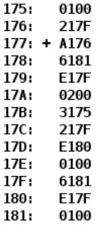
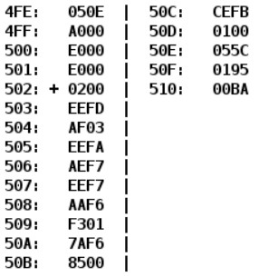
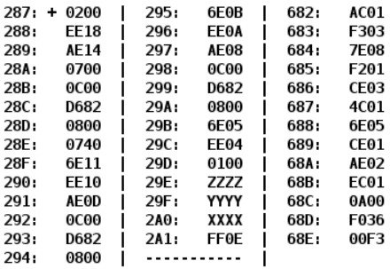

# [Лабораторная работа №2](https://github.com/KiVorobev/Basics-of-professional-activity/tree/main/Lab2)
По выданному преподавателем варианту определить функцию, вычисляемую программой, область представления и область допустимых значений исходных данных и результата, выполнить трассировку программы, предложить вариант с меньшим числом команд. При выполнении работы представлять результат и все операнды арифметических операций знаковыми числами, а логических операций набором из шестнадцати логических значений.

# [Лабораторная работа №3](https://github.com/KiVorobev/Basics-of-professional-activity/tree/main/Lab3)
По выданному преподавателем варианту восстановить текст заданного варианта программы, определить предназначение и составить описание программы, определить область представления и область допустимых значений исходных данных и результата, выполнить трассировку программы.

# [Лабораторная работа №4](https://github.com/KiVorobev/Basics-of-professional-activity/tree/main/Lab4)
По выданному преподавателем варианту восстановить текст заданного варианта программы и подпрограммы (программного комплекса), определить предназначение и составить его описание, определить область представления и область допустимых значений исходных данных и результата, выполнить трассировку программного комплекса.

# [Лабораторная работа №5](https://github.com/KiVorobev/Basics-of-professional-activity/tree/main/Lab5)
По выданному преподавателем варианту разработать программу асинхронного обмена данными с внешним устройством. При помощи программы осуществить ввод или вывод информации, используя в качестве подтверждения данных сигнал (кнопку) готовности ВУ.

1. Программа осуществляет асинхронный ввод данных с ВУ-3
2. Программа начинается с адреса 1B2(HEX). Размещаемая строка находится по адресу 632(HEX).
3. Строка должна быть представлена в кодировке Windows-1251.
4. Формат представления строки в памяти: АДР1: СИМВ2 СИМВ1 АДР2: СИМВ4 СИМВ3 ... СТОП_СИМВ.
5. Ввод или вывод строки должен быть завершен по символу c кодом 0D (CR). Стоп символ является обычным символом строки и подчиняется тем же правилам расположения в памяти что и другие символы строки.
6. После ввода данных и стоп-символа программа выводит символы на ВУ-5.
